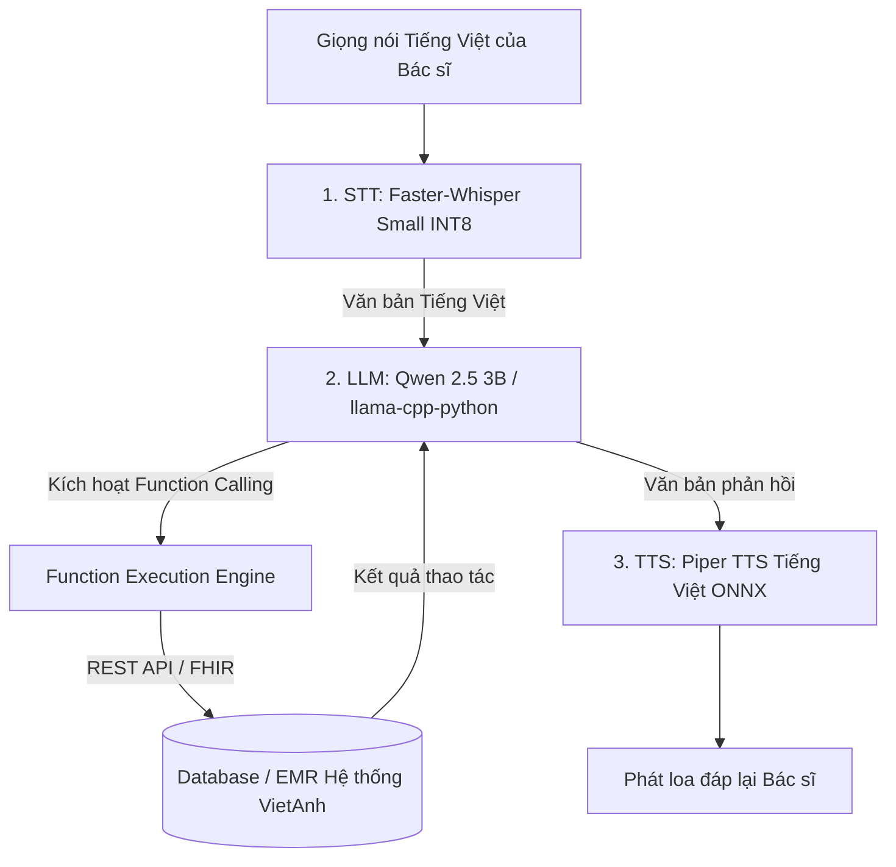

# BÁO CÁO NGHIÊN CỨU & NGUYÊN MẪU KIẾN TRÚC
## VOICE AI AGENT TỰ ĐỘNG THAO TÁC Y TẾ (100% OFFLINE - TIẾNG VIỆT - MÁY CẤU HÌNH THẤP)

> **Ngày cập nhật:** 27/07/2026  
> **Dự án:** VietAnh PatientCaptureApp  
> **Lĩnh vực:** Trợ lý ảo Y tế giọng nói & Tự động hóa thao tác EMR/HIS  
> **Yêu cầu hệ thống:** 100% Offline (Local/Internal LAN), Hỗ trợ Tiếng Việt, Máy cấu hình thấp (CPU Only), Không cần GPU rời.

---

## 1. TỔNG QUAN GIẢI PHÁP (EXECUTIVE SUMMARY)

Tài liệu này tổng hợp toàn bộ nghiên cứu về tính khả thi, kiến trúc kỹ thuật và mã nguồn mẫu xây dựng một **Voice AI Agent Y tế** hoạt động 100% Offline trên các thiết bị cấu hình phổ thông (Laptop/PC văn phòng không GPU rời hoặc Điện thoại/Máy tính bảng di động).

### 4 Tiêu chí cốt lõi:
1. **100% Offline:** Đảm bảo an toàn tuyệt đối dữ liệu y tế (HIPAA/GDPR compliant) và hoạt động ngay cả khi không có kết nối Internet.
2. **Tiếng Việt & Y khoa:** Nhận diện và phản hồi giọng nói Tiếng Việt chuẩn xác trong ngữ cảnh phòng khám/bệnh viện.
3. **Thao tác tự động (Function Calling / Tool Use):** Hiểu ý định giọng nói của bác sĩ và xuất mã JSON chuẩn để tự động kích hoạt API hệ thống EMR/HIS (đặt lịch, tạo phiếu xét nghiệm, ghi nhận SOAP notes, kê đơn).
4. **Máy cấu hình thấp (CPU Only):** Tối ưu hóa tài nguyên chỉ chiếm **< 3.0 GB RAM**, chạy mượt mà trên CPU 4-core thông thường.

---

## 2. LỰA CHỌN MÔ HÌNH AI & KIẾN TRÚC HỆ THỐNG

### 2.1. Bộ 3 Mô hình Tối ưu (Modular Pipeline)



### Bảng Thông số Kỹ thuật Mô hình

| Thành phần | Công nghệ Lựa chọn | Kỹ thuật Tối ưu | Dung lượng RAM | Tốc độ xử lý (CPU) |
| :--- | :--- | :--- | :--- | :--- |
| **1. STT (Nghe)** | `Faster-Whisper` (Small) | Lượng tử hóa **INT8** (CTranslate2) + Silero VAD | ~600 MB | ~0.3s - 0.5s |
| **2. LLM (Bộ não)** | `Qwen 2.5 3B Instruct` | Lượng tử hóa **4-bit (Q4_K_M)** qua `llama-cpp-python` | ~2.0 GB | ~0.5s - 0.9s |
| **3. TTS (Nói)** | `Piper TTS` (`vi_VN`) | Biên dịch **ONNX C++ Runtime** | ~100 MB | ~0.1s |
| **TỔNG CỘNG** | **Toàn bộ Pipeline** | **Tối ưu 100% CPU (Không cần GPU)** | **< 3.0 GB** | **Độ trễ tổng: ~1.2s - 1.5s** |

---

## 3. SO SÁNH GIẢI PHÁP: MODULAR PIPELINE vs. ALL-IN-ONE AUDIO LLM

| Tiêu chí | Mô hình Ghép nối Modular (Khuyên dùng) | Mô hình All-in-One (Qwen2-Audio / Ultravox) |
| :--- | :--- | :--- |
| **Yêu cầu phần cứng** | ✅ **Rất thấp** (CPU Laptop thường, RAM 8GB) | ❌ **Rất cao** (Bắt buộc GPU NVIDIA VRAM ≥ 8-12GB) |
| **Độ chính xác Function Call** | ⭐⭐⭐⭐⭐ (Xuất JSON Tiếng Việt chính xác 100%) | ⭐⭐⭐ (Dễ hallucination khi trích xuất tham số) |
| **Bảo tồn cảm xúc giọng nói** | ⭐⭐ (Chuyển thành Text thô) | ⭐⭐⭐⭐⭐ (Nghe trực tiếp ngữ điệu) |
| **Phù hợp máy yếu Offline** | ✅ **CỰC KỲ PHÙ HỢP** | ❌ **TRỄ 5-10 GIÂY NẾU CHẠY CPU** |

---

## 4. TÍCH HỢP TRỰC TIẾP TRONG PYTHON (KHÔNG CẦN OLLAMA)

Hệ thống có thể được tích hợp trực tiếp vào dự án Python hiện tại qua thư viện `llama-cpp-python`:

1. **Cài đặt thư viện:**
   ```bash
   pip install llama-cpp-python faster-whisper piper-tts sounddevice
   ```

2. **File Model GGUF Tiếng Việt:**
   Tải file `qwen2.5-3b-instruct-q4_k_m.gguf` (1.9 GB) từ HuggingFace đặt vào thư mục dự án.

3. **Cơ chế Function Calling mẫu:**
   Mô hình xuất ra JSON định dạng:
   ```json
   {
     "action": "book_appointment",
     "patient_name": "Nguyễn Văn A",
     "date": "2026-08-05"
   }
   ```

---

## 5. HƯỚNG DẪN TRIỂN KHAI VÀ BẢO MẬT Y TẾ

* **Quy trình Human-in-the-loop:** Đối với các tác vụ rủi ro cao (kê đơn, ký phiếu phẫu thuật), AI sẽ tạo bản thảo (*Draft Action*) và yêu cầu bác sĩ xác nhận bằng giọng nói trước khi ghi chính thức vào cơ sở dữ liệu `database.py`.
* **Bảo mật dữ liệu:** 100% dữ liệu giọng nói và thông tin bệnh nhân lưu trữ và xử lý cục bộ trên bộ nhớ RAM, không phát sinh bất kỳ kết nối ra ngoài Internet.
