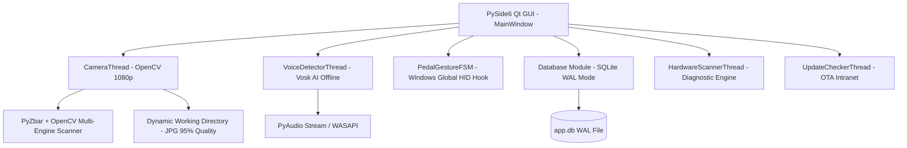

# TÀI LIỆU ĐẶC TẢ KỸ THUẬT HỆ THỐNG (SYSTEM TECHNICAL SPECIFICATION)
## Patient Capture Workstation - 354 Hospital Edition
**Phiên bản:** v1.0.0 | **Ngày phát hành:** 27/07/2026

---

## 1. TỔNG QUAN HỆ THỐNG (SYSTEM OVERVIEW)

### 1.1 Mục tiêu Dự án
Hệ thống **Patient Capture Workstation** là giải pháp phần mềm chuyên dụng phục vụ công tác chụp ảnh, lưu trữ và đối chiếu hình ảnh Bệnh án Điện tử (EMR) tại Bệnh viện 354. Phần mềm cho phép Y Bác sĩ và Kỹ thuật viên thao tác **Rảnh tay 100% (Hands-Free Operations)** thông qua Bàn đạp chân USB và Lệnh giọng nói Tiếng Việt Offline, loại bỏ nguy cơ lây nhiễm khuẩn chéo và chuẩn hóa dữ liệu hình ảnh lâm sàng.

### 1.2 Kiến trúc Hệ thống (Architecture Diagram)



---

## 2. ĐẶC TẢ TÍNH NĂNG CỐT LÕI (CORE FUNCTIONAL SPECIFICATIONS)

### 2.1 Quét & Giải Mã Mã Vạch / QR Code (Multi-Engine Barcode Engine)
- **Chuẩn mã vạch hỗ trợ**: JSON QR, URL QR (`https://his...?id=BN123`), Chuỗi phân tách (`BN123|Nguyễn Văn A|1952|Nam`), Code 128, Code 39, QR Code tiêu chuẩn.
- **Thuật toán xử lý ảnh 8 cấp độ (8-Stage Multi-Engine)**:
  1. PyZbar Grayscale gốc.
  2. PyZbar + Lọc tương phản CLAHE (Khử bóng chói màn hình điện thoại/giấy bóng).
  3. PyZbar + Ngưỡng binarization Otsu.
  4. OpenCV Barcode Detector.
  5. OpenCV QR Code Detector.
  6. PyZbar + Xoay ảnh 90 độ (Xử lý mã dọc).
  7. PyZbar + Unsharp Mask (Xử lý mờ nét).
  8. PyZbar + Siêu phân giải Super-Resolution 1.8x (Xử lý mã nhỏ/xa).
- **Tốc độ xử lý**: < 100ms per frame.

### 2.2 Điều Khiển Rảnh Tay (Hands-Free Control System)
1. **Bàn Đạp Chân (USB FootSwitch - HID Global Hook)**:
   - Phím nhận diện: `F13`, `ALT`, `F12`.
   - Cử chỉ FSM:
     - **Single Tap (1 giậm)** -> Chụp ảnh bệnh nhân (`ACTION_CAPTURE`).
     - **Double Tap (2 giậm)** -> Xóa ảnh vừa chụp (`ACTION_DELETE_LAST`).
     - **Triple Tap (3 giậm)** -> Chuyển bệnh nhân mới (`ACTION_NEXT_PATIENT`).
     - **Long Press (>1500ms)** -> Xem ảnh phóng to (`ACTION_VIEW_PHOTO`).
2. **Nhận Diện Giọng Nói Tiếng Việt Offline (Vosk Speech AI)**:
   - Mô hình AI: `vosk-model-small-vn-0.4` (Chạy hoàn toàn Offline 100%).
   - Từ khóa khớp chuẩn: `"chụp"`, `"xóa"`, `"tiếp"`, `"xem"`.
   - Cooldown khử nhiêu lặp: 2.0 giây.

### 2.3 Quản Lý Bệnh Nhân & Lưu Trữ Hình Ảnh
- **Thư mục làm việc động (Dynamic Working Directory)**: Tùy chỉnh lưu trữ trên bất kỳ ổ đĩa nội cục (`C:`, `D:`) hoặc ổ đĩa mạng Intranet (`\\server\emr_photos`).
- **Cấu trúc lưu trữ**: `{working_dir}/{patient_id}/{patient_id}_{YYYYMMDD_HHMMSS}_{index:02d}.jpg`.
- **Chất lượng hình ảnh**: JPEG Quality 95%, giữ đúng độ phân giải phần cứng (1920x1080).
- **Màn hình chia đôi đối chiếu (Split-screen Baseline View)**:
  - Bên trái: Luồng Camera thời gian thực.
  - Bên phải: Ảnh mốc đợt 1 (hoặc ảnh tùy chọn qua menu chuột phải).

---

## 3. ĐẶC TẢ CƠ SỞ DỮ LIỆU (DATABASE SCHEMA SPECIFICATION)

Cơ sở dữ liệu SQLite chạy chế độ **WAL (Write-Ahead Logging)** để đảm bảo an toàn truy xuất đa luồng đồng thời.

```sql
-- 1. Bảng Bệnh Nhân
CREATE TABLE IF NOT EXISTS patients (
    id TEXT PRIMARY KEY,
    name TEXT,
    birth_year INTEGER,
    gender TEXT,
    created_at TEXT NOT NULL
);

-- 2. Bảng Nhân Viên Y Tế
CREATE TABLE IF NOT EXISTS staff (
    id TEXT PRIMARY KEY,
    name TEXT NOT NULL,
    title TEXT,
    department TEXT,
    status TEXT DEFAULT 'ACTIVE'
);

-- 3. Bảng Hình Ảnh Chụp
CREATE TABLE IF NOT EXISTS photos (
    id INTEGER PRIMARY KEY AUTOINCREMENT,
    patient_id TEXT NOT NULL,
    operator_id TEXT,
    operator_name TEXT,
    file_path TEXT NOT NULL,
    captured_at TEXT NOT NULL,
    FOREIGN KEY (patient_id) REFERENCES patients (id) ON DELETE CASCADE
);

-- 4. Bảng Nhật Ký Kiểm Toán (Audit Logs)
CREATE TABLE IF NOT EXISTS audit_logs (
    id INTEGER PRIMARY KEY AUTOINCREMENT,
    timestamp TEXT NOT NULL,
    event_type TEXT NOT NULL,
    operator_name TEXT,
    patient_id TEXT,
    details TEXT
);

-- 5. Bảng Ánh Xạ Hành Động Nhân Viên (Action Mappings)
CREATE TABLE IF NOT EXISTS staff_action_mappings (
    id INTEGER PRIMARY KEY AUTOINCREMENT,
    staff_id TEXT NOT NULL,
    trigger_source TEXT NOT NULL,
    trigger_value TEXT NOT NULL,
    action_id TEXT NOT NULL,
    updated_at TEXT NOT NULL,
    FOREIGN KEY (staff_id) REFERENCES staff (id) ON DELETE CASCADE,
    UNIQUE(staff_id, trigger_source, trigger_value)
);

-- 6. Bảng Bộ Nhớ Đệm Phần Cứng Scanned Cache
CREATE TABLE IF NOT EXISTS hardware_devices (
    device_type TEXT NOT NULL,
    device_name TEXT NOT NULL,
    device_index INTEGER DEFAULT 0,
    device_info TEXT,
    updated_at TEXT NOT NULL,
    PRIMARY KEY (device_type, device_name, device_index)
);
```

---

## 4. QUẢN LÝ ĐA LUỒNG & BỘ NHỚ (MULTI-THREADING & MEMORY MANAGEMENT)

### 4.1 Danh sách Luồng Độc Lập (QThread Architecture)
1. **`CameraThread` (QThread)**: Đọc luồng video OpenCV 30 FPS, phát tín hiệu QImage đã sao chép bộ nhớ độc lập (`.copy()`), thực hiện chụp ảnh & quét mã vạch background.
2. **`VoiceDetectorThread` (QThread)**: Mở stream PyAudio WASAPI 16kHz, chạy mô hình Kaldi Vosk AI, tính toán Volume RMS độ nhạy micro và phát tín hiệu từ khóa.
3. **`HardwareScannerThread` (QThread)**: Quét chẩn đoán các cổng USB UVC, Audio Input, HID Pedal, COM Serial Ports không làm đơ main GUI thread.
4. **`UpdateCheckerThread` (QThread)**: Kiểm tra và tải bản cập nhật OTA từ Server Intranet ngầm.

### 4.2 Nguyên Tắc An Toàn Bộ Nhớ & Thread Safety
- **Tránh rò rỉ QImage**: Sử dụng `QImage(...).copy()` trước khi emit signal qua Qt Event Loop.
- **An toàn dừng luồng (Shutdown Safety)**: Bỏ hoàn toàn `QThread.terminate()`, áp dụng dừng luồng hợp tác (*Cooperative Flag Check*) với `wait(1000)`.
- **An toàn SQLite**: Mọi kết nối CSDL đều được giải phóng trong khối `try...finally: conn.close()`.

---

## 5. CẤU TRÚC MÃ NGUỒN (CODEBASE DIRECTORY STRUCTURE)

```
VietAnh/
├── main.py                     # Cửa sổ chính MainWindow & các luồng giao diện Qt
├── config.py                   # Quản lý file cấu hình config.json & QSS Theme
├── database.py                 # Hàm tương tác SQLite CSDL & Audit Logs
├── voice_detector.py           # Luồng nhận diện giọng nói Vosk AI Offline & PyAudio
├── pedal_gesture_fsm.py        # Máy trạng thái hữu hạn (FSM) phân tích cử chỉ bàn đạp
├── hardware_test_dialogs.py    # Modal kiểm thử phần cứng & Dialog xem ảnh PySide6 nội bộ
├── barcode_parser.py           # Bộ giải mã chuẩn mã vạch / QR Bệnh án
├── action_registry.py          # Hệ thống đăng ký & điều phối hành động lâm sàng
├── updater.py                  # Luồng cập nhật OTA tự động qua Intranet
├── PatientCaptureApp.spec      # File cấu hình đóng gói PyInstaller .exe
├── requirements.txt            # Danh sách thư viện phụ thuộc Python
└── docs/                       # Tài liệu đặc tả & kế hoạch thực thi
```

---

## 6. QUY TRÌNH ĐÓNG GÓI & CẬP NHẬT (BUILD & OTA PROTOCOL)

### 6.1 Lệnh đóng gói PyInstaller
```bash
pyinstaller PatientCaptureApp.spec
```

### 6.2 Cấu trúc file cấu hình OTA Intranet (`version.json`)
```json
{
    "version": "1.0.1",
    "url": "http://192.168.1.100/updates/update_v1.0.1.zip",
    "sha256": "e3b0c44298fc1c149afbf4c8996fb92427ae41e4649b934ca495991b7852b855"
}
```
Khi phát hiện bản mới, luồng `UpdateCheckerThread` tải file zip, xác thực mã băm SHA-256, sinh script `updater.bat` và kích hoạt tự động khởi động lại ứng dụng.
