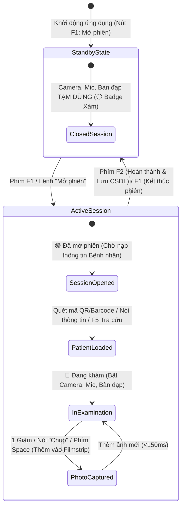

# TÀI LIỆU LUỒNG UI/UX HỆ THỐNG CHỤP ẢNH BỆNH NHÂN LÂM SÀNG

> **⚠ SUPERSEDED (session / hotkeys / voice / Tab2 rules):** dùng `docs/SPEC_HANDS_FREE_SESSION_V1.md` + `docs/PATIENT_SESSION_CONTROLLER_SPEC.md` + `CONTEXT.md`. Tài liệu dưới đây giữ lại để tham khảo bố cục UI cũ; **không** lấy F2=hoàn thành / PDF / pedal đa cử chỉ làm nguồn sự thật.

> **Phiên bản:** 2.0 (Cập nhật theo kiến trúc mới nhất)  
> **Môi trường:** Offline Windows Desktop App (PySide6 / Qt6)  
> **Mục tiêu:** Vận hành Hands-free (Rảnh tay), tối ưu trải nghiệm bác sĩ lâm sàng, đảm bảo chuẩn xác dữ liệu bệnh án.

---

## 1. TỔNG QUAN KIẾN TRÚC GIAO DIỆN (UI NAVIGATION ARCHITECTURE)

Hệ thống được thiết kế theo dạng **Monolithic Multi-Tab Desktop Architecture** với thanh điều hướng cố định bên trái (**Fixed Left Sidebar**) kết nối 4 không gian làm việc độc lập:

```text
+-----------------------------------------------------------------------------------+
| FIXED LEFT SIDEBAR | WORKSPACE CONTENT AREA                                        |
|                    |                                                               |
| 📷 Tab 1: Cockpit  | Clinical Cockpit (Standby Banner, Camera Stream, Baseline, Filmstrip)|
| 🔍 Tab 2: Tra cứu  | Patient History & PDF Exporter (Timeline / Grid View)         |
| 👥 Tab 3: Nhân viên| Active Shift Operator Selection + Audit Logs                  |
| ⚙️ Tab 4: Cài đặt  | Hardware Calibration + Diagnostic Popups + Intranet OTA       |
+-----------------------------------------------------------------------------------+
```

---

## 2. STATE MACHINE PHIÊN KHÁM LÂM SÀNG (F1 / F2 SESSION FLOW)

Quy trình khám lâm sàng tuân thủ chặt chẽ State Machine phiên làm việc nhằm tiết kiệm tài nguyên hệ thống và bảo vệ quyền riêng tư của bệnh nhân:



### Chi tiết các trạng thái:

#### 1. Chế độ Chờ (Standby / Closed Session)
* **Visual Cue:** Badge xám `⚪ PHIÊN ĐÃ KẾT THÚC (CHẾ ĐỘ CHỜ): Camera, Bàn đạp & Giọng nói đang TẮT`.
* **Trạng thái thiết bị:** Camera stream dừng hiển thị, nhận dạng giọng nói và bàn đạp ngắt kích hoạt để tránh chụp nhầm.
* **Nút bấm:** `🚀 F1 Mở phiên làm việc` (Màu xanh lá).

#### 2. Chế độ Mở Phiên (Active Session)
* **Visual Cue:** Badge xanh lá `🟢 ĐÃ MỞ PHIÊN KHÁM: Sẵn sàng quét mã QR hoặc nhập Mã BN để bắt đầu`.
* **Nút bấm:** Chuyển sang `🏁 F1 Kết thúc phiên` (Màu đỏ).

#### 3. Chế độ Đang Khám (In Examination)
* **Kích hoạt khi:** Đã có đủ `Mã Bệnh Nhân` + `Họ và Tên`.
* **Visual Cue:** Banner chuyển sang màu xanh dương rực rỡ với Badge `🔴 ĐANG KHÁM: [Mã BN] - Họ tên`.
* **Nút bấm kết thúc:** Phím tắt **F2** (`✅ F2 Hoàn thành & Lưu CSDL`) -> Tự động lưu toàn bộ ảnh ca khám vào CSDL SQLite và thư mục lưu trữ, sau đó dọn dẹp form để sẵn sàng cho ca khám tiếp theo.

---

## 3. BỐ CỤC HIỂN THỊ THÔNG MINH (DYNAMIC CAMERA & BASELINE LAYOUT)

Khu vực trung tâm ứng dụng tự động điều chỉnh tỷ lệ khung hình tùy theo lịch sử khám của bệnh nhân:

```text
Chưa có ảnh Baseline (Bệnh nhân mới):
+-----------------------------------------------------------------------------------+
| CAMERA STREAM LOGITECH C920e (100% WIDESCREEN LIVE VIEW)                         |
+-----------------------------------------------------------------------------------+

Đã có ảnh Baseline (Bệnh nhân tái khám):
+-------------------------------------------------------+---------------------------+
| CAMERA STREAM LIVE VIEW (60%)                         | ÁNH BASELINE LẦN TRƯỚC    |
|                                                       | KHÁM (40%)                |
+-------------------------------------------------------+---------------------------+
```

* **100% Widescreen View:** Khi bệnh nhân mới hoặc chưa có dữ liệu ảnh trước đó, Panel Baseline tự động ẨN, dành 100% diện tích cho luồng Live Video của Camera để bác sĩ căn chỉnh góc chụp dễ dàng nhất.
* **60/40 Split Comparison:** Khi nạp bệnh nhân đã có ảnh Baseline, Panel 40% bên phải tự động HIỆN ảnh chụp của lần khám trước đó, giúp bác sĩ so sánh trực quan thương tổn/tiến triển điều trị theo thời gian thực.

---

## 4. LUỒNG NẠP DỮ LIỆU ĐA PHƯƠNG THỨC (MULTIMODAL INPUT FLOW)

Hệ thống hỗ trợ 3 kênh nạp thông tin bệnh nhân linh hoạt:

```
                  ┌───────────────────────────────────────────────┐
                  │ Quét Barcode / QR Code (9-Stage Engine)       │
                  └───────────────────────┬───────────────────────┘
                                          │
                  ┌───────────────────────▼───────────────────────┐
                  │ Phân tích Giọng nói (Sherpa-ONNX Zipformer)    ├──────► Form Bệnh Nhân
                  └───────────────────────┬───────────────────────┘        (Id, Tên, Tuổi, Nam/Nữ)
                                          │
                  ┌───────────────────────▼───────────────────────┐
                  │ F5 Mở Tra cứu Lịch sử (PatientGridDialog)     │
                  └───────────────────────────────────────────────┘
```

### 4.1. Quét Mã vạch / QR 9-Stage Engine & Visual Overlay
* **Visual Barcode Overlay:** Hiển thị khung chữ nhật định vị trực quan trên Video Stream khi phát hiện mã.
* **Multi-Format:** Hỗ trợ mã Code 128/39 (`PHCN...`, `XN...`), JSON QR string (`{"id": "...", "name": "..."}`), URL QR.
* **Async RapidOCR Fallback (Giai đoạn 9):** Nếu mã vạch bị out-of-focus hoặc nhòe do chuyển động, hệ thống tự động đẩy vùng ảnh chứa mã xuống **Background Thread** chạy RapidOCR để đọc mã chữ in bên dưới mã vạch. Camera stream vẫn duy trì mượt mà >30 FPS.

### 4.2. Bóc tách Thông tin Giọng nói (Voice Demographic Parsing)
* **Cập nhật từng trường (Partial Update):** Bác sĩ có thể đọc lẻ từng trường:
  * *"Họ và tên Nguyễn Văn A"* ➔ Điền trường Tên.
  * *"Năm sinh 1985"* ➔ Điền trường Năm sinh.
  * *"Giới tính Nam"* ➔ Điền trường Giới tính.
* **Cập nhật nguyên câu (Full Update):** Bác sĩ có thể đọc nguyên câu *"Bệnh nhân Trần Thị B năm sinh 1990 giới tính Nữ"*.
* **Quy tắc an toàn Mã BN:** Mã Bệnh Nhân **không bao giờ** tự sinh ngẫu nhiên qua giọng nói nhằm tránh sai lệch hồ sơ y khoa.

---

## 5. QUẢN LÝ ẢNH CA KHÁM & THAO TÁC RẢNH TAY (HANDS-FREE CAPTURE & FILMSTRIP)

### 5.1. Bảng Phím tắt & Cử chỉ Điều khiển

| Thao tác | Bàn đạp chân (Pedal) | Giọng nói (Offline) | Phím bàn phím | Hành động |
| :--- | :--- | :--- | :--- | :--- |
| **Chụp ảnh** | 1 Giậm (Single Tap) | Nói `"Chụp"` | Phím `Space` | Lưu ngầm ảnh (<150ms), đưa vào Filmstrip |
| **Xóa ảnh gần nhất** | 2 Giậm (Double Tap) | Nói `"Xóa ảnh"` | Phím `Delete` | Đưa ảnh vừa chụp vào Thùng rác tạm |
| **Xóa toàn bộ ảnh** | - | Nói `"Xóa toàn bộ"` | - | Đẩy toàn bộ ảnh phiên hiện tại vào Thùng rác |
| **BN Tiếp theo** | 3 Giậm (Triple Tap) | Nói `"Tiếp theo"` | - | Hoàn thành phiên và chuyển bệnh nhân mới |
| **Xem lại ảnh** | Nhấn Giữ (Long Press) | Nói `"Xem lại"` | - | Phóng to ảnh vừa chụp |

### 5.2. Thanh Filmstrip Carousel (Góc dưới màn hình)
* Hiển thị danh sách ảnh đã chụp dưới dạng Thumbnail cuộn ngang.
* Tự động bổ sung ngay sau khi kích hoạt chụp.
* Hỗ trợ click chuột vào ảnh để xem lại hoặc xóa trực tiếp từng ảnh.

---

## 6. HỆ THỐNG POP-UP CHẨN ĐOÁN PHẦN CỨNG (TAB 4 HARDWARE DIAGNOSTICS)

Tại Tab 4 (Cài đặt Hệ thống), bác sĩ/kỹ thuật viên có thể kiểm tra trực tiếp trạng thái thiết bị thông qua các Modal Dialog chẩn đoán tương tác:

1. **📷 Camera Test Dialog (`CameraTestDialog`)**:
   * Hiển thị luồng video 1080p và kiểm tra tính năng quét mã thực tế. Phát tiếng Beep và hiện Badge xanh `[ OK ]` khi quét thành công.
2. **🎙️ Microphone Test Dialog (`MicrophoneTestDialog`)**:
   * Tích hợp thanh đo âm lượng real-time (RMS Volume Gauge 0-100%) và nhận diện 4 lệnh chuẩn (`"chụp"`, `"xóa"`, `"tiếp"`, `"xem"`).
3. **🦶 Foot Pedal Test Dialog (`PedalTestDialog`)**:
   * Hiển thị Checklist 4 cử chỉ giậm bàn đạp. Bác sĩ giậm chân vào thiết bị thật, giao diện sẽ tự động tích xanh `[✓]` tương ứng theo thời gian thực.
4. **🔌 COM Serial Port Test Dialog (`COMPortTestDialog`)**:
   * Gửi gói tin Ping (`0x06`) tới cổng RS232/USB Serial để kiểm tra kết nối thiết bị ngoại vi.
